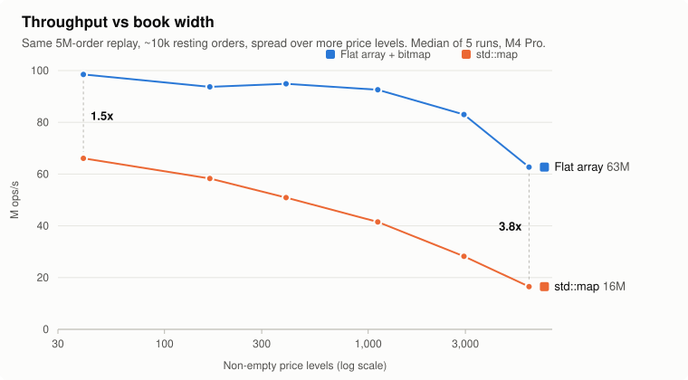

# orderbook

A price-time priority limit order book and matching engine in C++20. It is header-only and has no dependencies.

- **Orders:** limit (match, then rest the remainder), market (immediate-or-cancel), cancel, reduce quantity.
- **Hot path:** no heap allocation, no virtual calls, no floating point.
- **Two ladder implementations** behind one template parameter, benchmarked on identical order flow:
  - `ArrayLadder`: a flat array with one slot per price tick, plus a bitmap of non-empty levels.
  - `MapLadder`: a `std::map` keyed by price.
- **26 tests**, including a differential test that runs both books on 200k random operations and requires identical trades and book state after every operation. The tests also pass under AddressSanitizer and UndefinedBehaviorSanitizer.

## Results

5M operations (70% add, 27% cancel, 3% market) on a book that holds about 10k resting orders across about 170 price levels. Apple M4 Pro, Apple clang 21, `-O3`. Throughput is the median of 5 runs. I ran the benchmark three times and got the same throughput each time, within 2%.

| | Throughput | ns/op | market p99 |
|---|---|---|---|
| `ArrayLadder` | **~94M ops/s** | **10.7** | 42 ns |
| `MapLadder` | ~57M ops/s | 17.3 | 84 ns |

**The array ladder is 1.6x faster here, and the gap grows as the book gets wider.** With about 170 levels, the whole `std::map` (around 10 KB of nodes) fits in L1 cache, and a lookup is only about 7 comparisons. Spreading the same ~10k orders over more price levels makes the tree deeper and pushes it out of cache. The array's O(1) indexing barely notices until the levels themselves stop fitting in cache:



| Price levels | `ArrayLadder` | `MapLadder` | Array faster by |
|---|---|---|---|
| 40 | 98.5M ops/s | 66.1M ops/s | 1.5x |
| 167 | 93.7M | 58.3M | 1.6x |
| 395 | 94.9M | 50.9M | 1.9x |
| 1,114 | 92.6M | 41.5M | 2.2x |
| 2,951 | 83.0M | 28.2M | 2.9x |
| 6,156 | 62.7M | 16.5M | **3.8x** |

Each row is `./build/bench 5000000 10000 <depth>`, where `<depth>` is the mean distance of new orders from the mid price (2 to 2048 ticks). A second full sweep matched within 2%. Raw data: [`docs/data/depth_sweep.csv`](docs/data/depth_sweep.csv). To regenerate the chart, run `python3 docs/make_chart.py`.

The map also pays one heap allocation every time a new price level appears, and a wide book creates and empties levels far more often.

**Measurement caveat:** `steady_clock` on Apple Silicon ticks every 41 ns. That's longer than a typical operation, so per-operation p50 can't be measured, and the benchmark reports only throughput and tail percentiles. Max values (10–130 µs) are OS interrupts and vary between runs.

## Build

```sh
cmake -S . -B build && cmake --build build -j
./build/tests
./build/bench               # 5M ops, ~10k resting orders
./build/bench 5000000 10000 2048   # ops, target resting orders, depth (wide book)

# with sanitizers
cmake -S . -B build-asan -DCMAKE_BUILD_TYPE=Debug -DOB_SANITIZE=ON && cmake --build build-asan && ./build-asan/tests
```

## Design

```
OrderBook<Ladder>
├── bids_ : Ladder<Buy>    best = highest price
├── asks_ : Ladder<Sell>   best = lowest price
├── pool_ : Pool<Order>    every Order object is allocated once, up front
└── by_id_: vector<Order*> order id -> resting order, for O(1) cancel

PriceLevel  head ⇄ order ⇄ order ⇄ tail   (intrusive FIFO = time priority)
```

| Operation | ArrayLadder | MapLadder |
|---|---|---|
| Add (rests) | O(1) | O(log L) and an allocation if the level is new |
| Cancel | O(1), plus a bitmap scan if it empties the best level | O(1) unlink, plus O(log L) if the level empties |
| Match, per fill | O(1) | O(1), plus O(log L) per emptied level |
| Best bid/ask | O(1), cached | O(1), `begin()` |

The bitmap scan checks 64 price levels per instruction (`std::countl_zero` / `std::countr_zero`), so finding the next best price after the best level empties costs at most `ticks/64` word reads, and usually just one or two.

**Limits:**
- `ArrayLadder` needs a bounded price band (default 65,536 ticks).
- Order ids must be smaller than `max_order_id`, because the id index is a flat array. That fits an exchange that assigns its own ids, but not arbitrary client ids.
- There's no self-trade prevention.
- There's no thread safety. The book is meant to run on one thread per instrument, which is how most matching engines shard.
